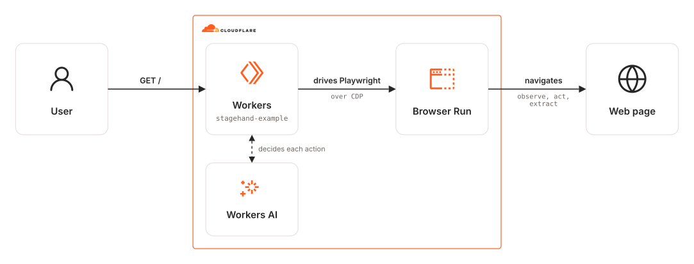

# wrangler-cloudflare-playwright-stagehand

Wrangler app that instructs Stagehand to perform certain actions using Cloudflare Workers AI and Browser Run with Playwright.

## Architecture Diagram

<picture>
  <source media="(prefers-color-scheme: dark)" srcset="./src/assets/arch-diagram-dark.svg">
  
</picture>

## Prerequisites

- **_Cloudflare:_**
  - Must have set the `CLOUDFLARE_API_TOKEN` variable in your local environment, with the `Workers Scripts:Edit` and `Account Settings:Read` permissions.
- **_mise:_**
  - [Install mise](https://mise.jdx.dev/installing-mise.html), which manages Node and pnpm.

## Installation

```sh
mise install
pnpm install
```
